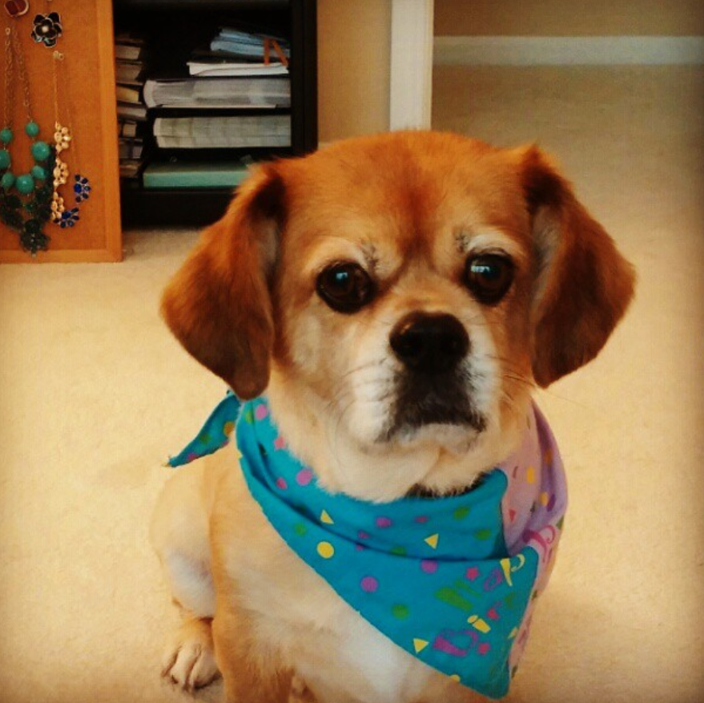

## Dog Breed ID using Tensorflow in GoogleColab

title: "Predictive Analytics for Bulldozer Pricing"
date: 2018-05-28
tags: [time series, data science, XGBoost]
header:
image: "images/scoobie.png"
excerpt: "time series, data science, XGBoost"
mathjax: "true"

---

Full analysis, predictions and models can be viewed here: [Jupyter Notebook](https://nbviewer.jupyter.org/github/t-shikuro/dog-breed-id/blob/master/notebooks/dog-vision.ipynb).

## Overview

🚜 This project was based on a [Kaggle competition](https://www.kaggle.com/c/dog-breed-identification/data?select=test). The data includes training and test set of dog images each with a unique `id`. The dataset comprises 120 dog breeds and the aim is to create a classifier able to determine the dog's breed based on dog photos (example: this is my dog Scoobie who died in late 2019 - he lived a long live 17 years!).

> RIP buddy
> 

So... how well can machine learning and specifically Tensorflow predict a dog's breed based just on jpeg image? That's what I'm about to find out!

## Exploratory Data analysis

> Dog Breed count
> 

> Breed List
> 

> Sample view of data and labels
> 

## Evaluation

Submissions are evaluated on Multi Class Log Loss between the predicted probability and the observed target.

- For more on the evaluation of this project check: https://www.kaggle.com/c/dog-breed-identification/overview/evaluation

## Data

### File descriptions

- `train.zip` - the training set, you are provided the breed for these dogs
- `test.zip` - the test set, you must predict the probability of each breed for each image
- `sample_submission.csv` - a sample submission file in the correct format
- `labels.csv` - the breeds for the images in the train set

* For more on the evaluation of this project check: https://www.kaggle.com/c/dog-breed-identification/overview/evaluation

## List of Breeds

> Kaggle provides a full list of breeds included in this dataset. It can be viewed at https://www.kaggle.com/c/dog-breed-identification/data

## Final Takeaway

> Predictions on custom images
> 

The takeaway from this project is working with batches. In the case of images usually one image file doesn't expend too much of a file size, however, loading and converting hundreds or even thousands of images can take a long time. By converting the images to a Tensor format: (image, label) the system works with tuple shape (224,224,3). The specific [Keras](https://www.tensorflow.org/api_docs/python/tf/keras/applications/MobileNetV2) model used for this project was `mobilenetv2-Adam`
